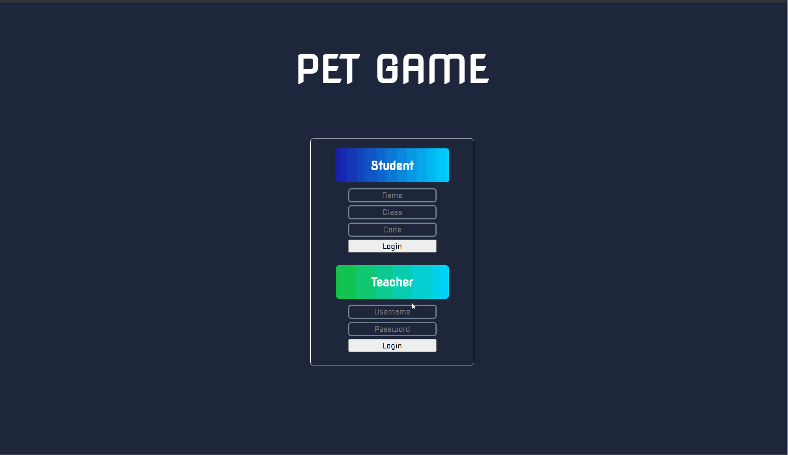
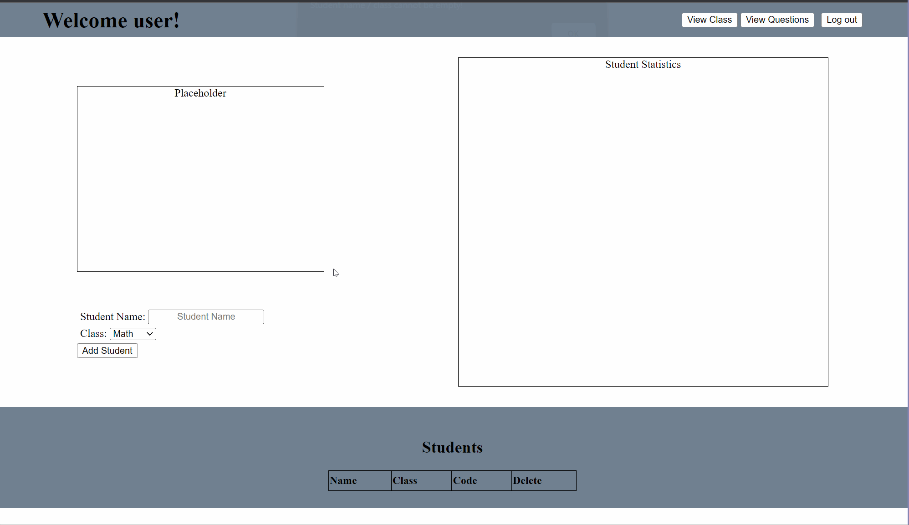
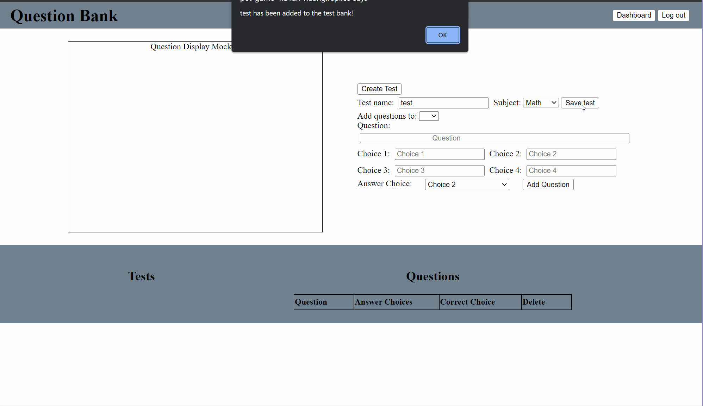
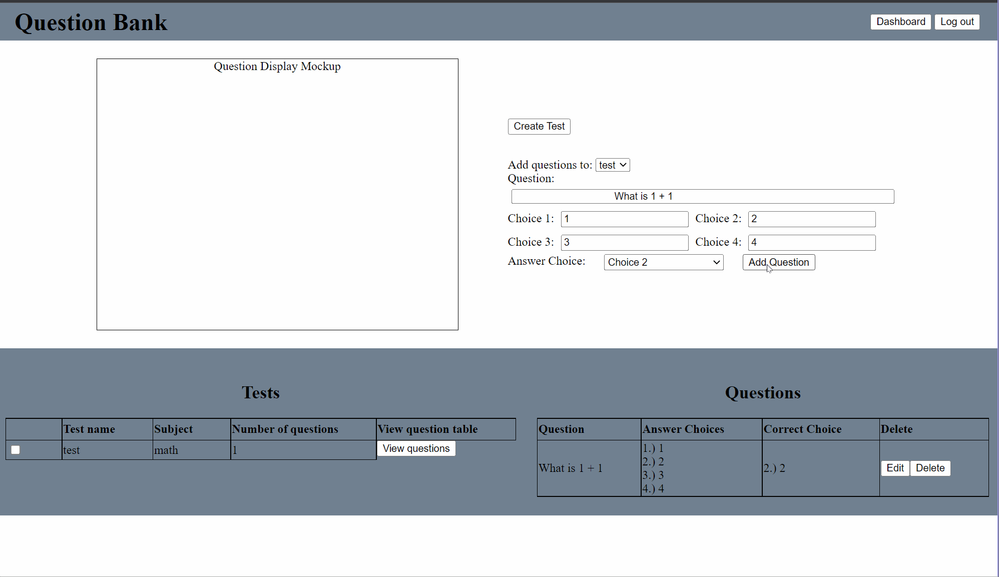

# Platinum Edge Tutoring Project
  <!--- Description --->
  * [Features](#features)
  * [Todos](#todos)
  * [Ideas](#ideas)
  * [Changelog](#changelog)
# Features
  
Landing Page

  
  
  <!--- 1. multi-select window that allows the teacher to send tests to students in a specific class --->
  
Teacher's Dashboard
	
  
  
	
  <!---  --->
  <!--- 2. selecting multiple students / questions / tests and delete them --->
  
Creating and removing test
	
  
  

  <!---  --->
  
Creating and deleting questions
		
  
  

  <!---  --->
  
# Todos
		
    1. Figure out how to export table as Excel file
    2. Change how the tables are generated using jQuery
    3. Create slide animations when appending new HTML elements with jQuery
    4. Figure out how students can access tests created by the teacher
    5. Optimize certain functions
	6. Learn how to pass form data to another HTML page

    7/11/22
		1. update input verification for adding questions
	  2. include popup confirm button for deleting students / questions
	  3. improve table display design (generation / layout)
   
    7/12/22
		1. Create more optional choices
		2. Change table layout
		3. Change alert messages to text
    4. add confirmation when removing / editing
		5. Make view button toggle the question table

    7/13/22
    1. implement creating new class
    2. sort students in alphabetical order
    3. group students by class
    4. work on teacher settings

    7/14/22
    1.brainstorm and work on student
    
# Ideas
    1. Optimize / improve project using jQuery, React, and SQL 
    2. Improve the design of the project

# Changelog

		7/11/22
		1. added 5th choice option in question bank page
		2. autocomplete attribute for 5th input is turned off
	  3. 5th answer choice correctly displays on the table
		4. updated 'add question' layout and 'create test' button dropdown
	  5. changed text font to match login page (for now)
   
    7/12/22
    1. implmented popup when checkbox is clicked for deleting test
		2. added more optional choices

    7/13/22
    1. updated visuals for dashboard and question bank
    2. implemented feature where teacher can send exams to certain classes

    7/14/22
    1. implemented teacher settings, now they are able to create and remove classes
    2. students and classes are now sorted in alphabetical order

    
# End Goal
    1. Implement Student Statistics Section which allows the teacher to see which topics the students are struggling on.
    2. Have a timing feature so students are timed, similarily to a real testing enviormnment 

# Questions
    1. Suggestions and Clarification on what we should do for the outline.

# Suggestion
    1. Do teacher have unique accounts?
    2. Improve visual level, have the classes listed instead of commas
    3. how do we make it so the student side feel more like a game. (make it so the progression through the test feel more game like.)
    4.(https://app.nearpod.com/presentation?pin=X58HG, https://wordwall.net/) <- example that makes it feel more like an game
    5. think about what makes a game fun? maybe progression?